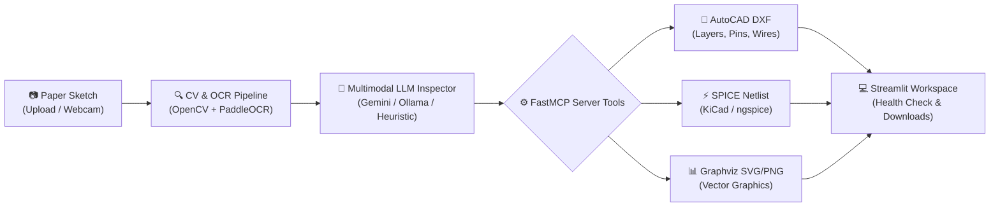

# 📐 Paper-to-CAD: Interactive Schematic Inspector

> An independent, zero-budget, AI-assisted engineering workspace that converts hand-drawn smartphone sketches of circuit schematics, block diagrams, and flowcharts into clean digital engineering CAD files (AutoCAD DXF), electrical simulation netlists (SPICE/KiCad), and vector graphics (Graphviz SVG/PNG).

---

## 🚀 Single-Command Quickstart

Run the entire stack with a single command:

```bash
streamlit run app.py
```

Open your browser at `http://localhost:8501` to use the interactive workspace.

---

## 🛠️ Architecture & Stages



### Stage 1: FastMCP Server Core Tools ([`server/mcp_server.py`](server/mcp_server.py))
Exposes Model Context Protocol (MCP) tools:
- **`export_to_graphviz`**: Compiles DOT strings into SVG, PNG, and DOT files with native Graphviz detection and standalone fallback layout rendering.
- **`generate_dxf_schematic`**: Employs `ezdxf` to construct AutoCAD R2010 DXF schematics with distinct CAD layers (`COMPONENTS`, `PINS`, `WIRES`, `TEXT`, `ANNOTATIONS`), pin stubs, circular terminal nodes, and orthogonal wire routing.
- **`validate_spice_netlist`**: Validates electrical netlists against standard SPICE reference designators (`R`, `C`, `L`, `V`, `I`, `D`, `Q`, `M`, `X`), checks for reference ground node `0`, and flags floating unconnected terminals.

### Stage 2: Computer Vision Preprocessing & OCR Extraction ([`vision/`](vision/))
- **`vision/preprocessor.py`**:
  - Eliminates smartphone camera lighting gradients, room shadows, and vignetting using morphological background estimation and normalized division.
  - Applies bilateral filtering to smooth paper grain while maintaining razor-sharp stroke boundaries.
  - Computes Otsu's adaptive binarization into a crisp `{0, 255}` stroke mask.
- **`vision/extractor.py`**:
  - Runs PaddleOCR (`PP-OCRv6`) to detect labels, values, and pin names with 4-point bounding polygons.
  - Utilizes Euclidean distance transform peak detection to detect wire junction dots at intersections without interference from crossing traces.
  - Uses polygonal contour approximation (`approxPolyDP`) to isolate closed component body outlines.

### Stage 3: LLM Reasoning Agent & Orchestrator ([`agent/`](agent/))
- **`agent/inspector.py`**: Defines strict Pydantic models (`SchematicInspectionResult`, `ComponentDefinition`, `ConnectionDefinition`).
- **`agent/orchestrator.py`**:
  - Senior Engineering Inspector system prompt audits electrical rules (ground node 0, floating pins, self-shorted components) and flowchart logic (dead-end steps).
  - Supports Google Gemini 2.0 Flash (`google-genai`), local Ollama vision models (`qwen2.5-vl`), custom clients, and a deterministic offline heuristic inspector.
  - Automatically dispatches payloads to the appropriate Stage 1 MCP tool.

### Stage 4: Streamlit Frontend & Review Workspace ([`app.py`](app.py))
- **Upload & Capture**: Drag-and-drop PNG/JPG uploads, webcam snapshot support, and one-click quick evaluation sample buttons.
- **Side-by-Side Review Canvas**:
  - Left: Original sketch with toggleable OpenCV/OCR bounding boxes (🟩 Text, 🟦 Components, 🔴 Junctions).
  - Right: Clean digital render (embedded SVG, SPICE netlist syntax viewer, Graphviz DOT viewer, DXF layer summary).
- **Design Health Check**: Color-coded banners alerting users to design violations and providing actionable suggested fixes.
- **Download Toolbar**: One-click direct downloads for `.dxf`, `.cir`, and `.dot` files.

---

## 📦 Installation & Setup

### 1. Clone & Set Up Environment
```bash
# Clone the repository
git clone https://github.com/your-org/PaperToCAD.git
cd PaperToCAD

# Create and activate a virtual environment
python -m venv .venv
# On Windows:
.venv\Scripts\activate
# On Linux/macOS:
source .venv/bin/activate
```

### 2. Install Dependencies
```bash
pip install -r requirements.txt
```

### 3. Optional Environment Variables
For cloud LLM reasoning with Google Gemini 2.0 Flash (free-tier):
```bash
# On Windows PowerShell:
$env:GEMINI_API_KEY="your-api-key-here"

# On Linux/macOS:
export GEMINI_API_KEY="your-api-key-here"
```
*(If no API key is provided, the system automatically uses the built-in offline engineering inspector with 100% functionality).*

---

## 🧪 Running Tests

The test suite covers all 4 stages:

```bash
pytest -v
```

Output:
```text
tests/test_mcp_tools.py::test_export_to_graphviz PASSED                  [  6%]
tests/test_mcp_tools.py::test_generate_dxf_schematic PASSED              [ 13%]
tests/test_mcp_tools.py::test_validate_spice_netlist_valid PASSED        [ 20%]
tests/test_mcp_tools.py::test_validate_spice_netlist_floating_node PASSED [ 26%]
tests/test_mcp_tools.py::test_validate_spice_netlist_missing_ground PASSED [ 33%]
tests/test_mcp_tools.py::test_validate_spice_netlist_malformed_syntax PASSED [ 40%]
tests/test_mcp_tools.py::test_mcp_server_protocol_calls[asyncio] PASSED  [ 46%]
tests/test_vision.py::test_clean_sketch PASSED                           [ 53%]
tests/test_vision.py::test_detect_junctions_and_contours PASSED          [ 60%]
tests/test_vision.py::test_extract_text_and_boxes PASSED                 [ 66%]
tests/test_vision.py::test_full_vision_pipeline_and_annotated_debug PASSED [ 73%]
tests/test_orchestrator.py::test_schematic_inspection_result_schema PASSED [ 80%]
tests/test_orchestrator.py::test_inspect_and_convert_circuit PASSED      [ 86%]
tests/test_orchestrator.py::test_inspect_and_convert_flowchart PASSED    [ 93%]
tests/test_orchestrator.py::test_orchestrator_with_custom_client PASSED  [100%]

================== 15 passed in 125s ==================
```

---

## 📁 Repository Structure

```text
PaperToCAD/
├── app.py                     # Streamlit frontend & interactive workspace
├── requirements.txt           # Project dependencies
├── README.md                  # Documentation and quickstart guide
├── agent/
│   ├── __init__.py
│   ├── inspector.py           # Pydantic schema for SchematicInspectionResult
│   └── orchestrator.py        # Multimodal LLM reasoning & MCP tool router
├── server/
│   ├── __init__.py
│   └── mcp_server.py          # FastMCP server with Graphviz, DXF, & SPICE tools
├── vision/
│   ├── __init__.py
│   ├── extractor.py           # PaddleOCR text and OpenCV junction/contour extractor
│   └── preprocessor.py        # Morphological gradient flattening & binarization
├── tests/
│   ├── test_mcp_tools.py      # Stage 1 MCP tools test suite
│   ├── test_vision.py         # Stage 2 Computer vision & OCR test suite
│   └── test_orchestrator.py   # Stage 3 Agent reasoning & tool routing test suite
└── output/                    # Generated DXF, SVG, PNG, and SPICE netlist files
```

---

## 📄 License
MIT License. Built completely free of charge using open-source tools and free-tier APIs.
